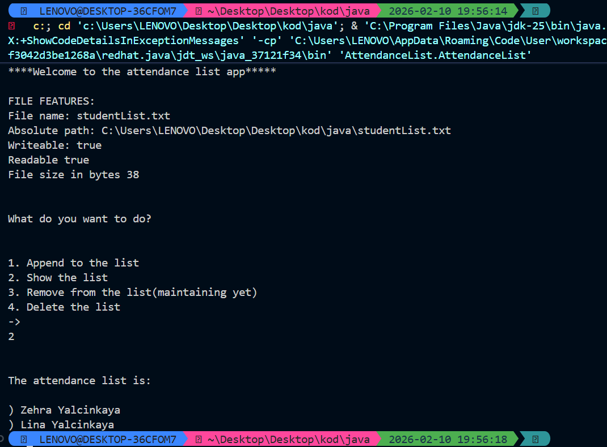

📝 Attendance List Management System
This Java-based application provides a robust way to manage student attendance lists using file handling. It demonstrates clean code principles by separating business logic (Operations) from the user interface (Main).

🌟 Features
Automatic File Creation: Checks for the existence of studentList.txt and creates it if missing.

Detailed File Metrics: Displays absolute path, file size, and read/write permissions upon startup.

Append Logic: Users can add new students to the list without overwriting existing data (using FileWriter in append mode).

Static Utility Methods: Operations are handled via static methods, showcasing a utility-class design pattern.

Safe Resource Management: Implements try-with-resources to ensure file streams are closed automatically, preventing memory leaks.

🏗️ Technical Architecture
The project is divided into specialized modules within the AttendanceList package:

AttendanceList (Main Class): Handles user interaction and the main menu logic.

Operations (Logic Class): Contains static methods for file manipulation (append, show, delete).

Exceptions (Planned): A dedicated class for future custom exception handling.

🛠️ Usage
Run the application.

View File Info: The console will display the current status of your studentList.txt.

Choose an Action:

1: Add a student.

2: Read the entire list from the disk.

4: Securely delete the attendance file.

💻 Sample Output

