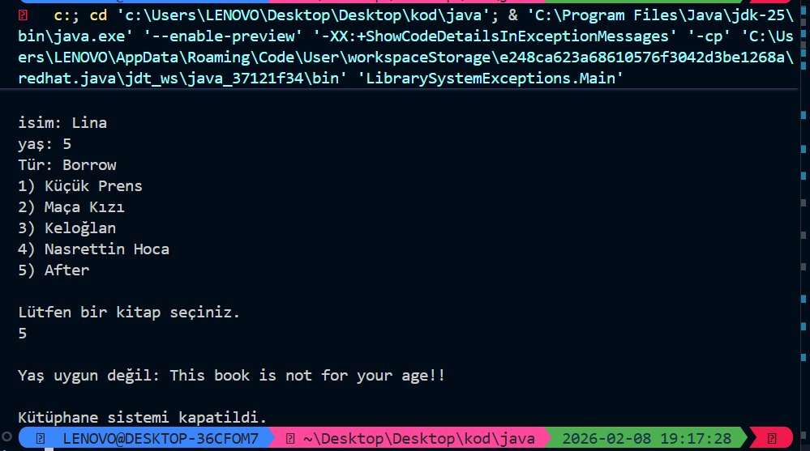

## 📚 Advanced Library System (Exception Handling & Logic)
This project is a comprehensive library simulation that demonstrates advanced error handling and user interaction.

### 🌟 Key Features:
* **Custom Exception Suite:** Created specialized exceptions like `NoBookIdx` and `OutOfTypes` for precise error reporting.
* **Smart Age Control:** Implemented a `dangerList` logic where age restrictions apply only to specific sensitive content.
* **Input Validation:** Robust handling of user inputs using `Scanner` with buffer clearing techniques.
* **Transaction Safety:** Uses `try-catch-finally` and `System.exit()` to ensure the system closes securely on critical errors.

### 🛠️ Technical Concepts:
`Custom Exceptions`, `Multi-Catch`, `Ternary Operators`, `Array Looping`, `Scanner Buffer Management`.

*****TERMİNAL OUTPUT******

