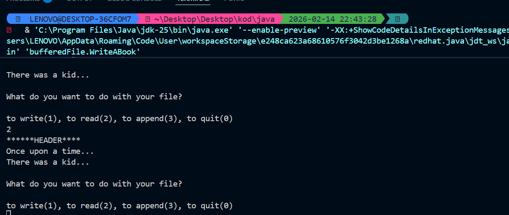

📚 WriteABook - Java Buffered I/O Project
This project is a Java-based command-line application designed to handle file operations efficiently using Buffered Streams. It allows users to write, read, and append text to a persistent file while demonstrating best practices in Java File I/O.

🌟 Key Features
Performance Optimized: Uses BufferedWriter and BufferedReader to minimize direct disk access, making operations faster and more efficient.

Try-with-Resources: Implements modern Java resource management to ensure all file streams are automatically closed, preventing memory leaks.

Append Mode Logic: Demonstrates how to add data to an existing file without overwriting the previous content using the FileWriter(file, true) flag.

Clean Architecture: Separates the User Interface (WriteABook) from the Logic/Methods (Methods), making the code scalable and readable.

🛠️ Technical Implementation
The project consists of two main components:

WriteABook.java: The controller class that manages the user menu and input handling via Scanner.

Methods.java: The engine class containing the static logic for:

bufferedWriter(): Resets the file and adds a standard header.

bufferedReader(): Streams the file content line-by-line to the console.

appendFile(String line): Seamlessly adds new lines to the end of the file.

🚀 TERMİNAL OUTPUT

